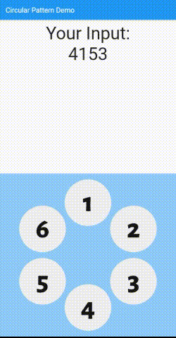

# circular_pattern

Circular Pattern is a flutter package similar to mobile pattern lock which dots designed in a circular form

## Features

- A string symbol can be inserted to the middle of the pattern points
- Editable font and color theme 

## Getting started

Import package and add CircularPattern to the widget tree.



## Usage

An example usage can be found at `/example` folder. 

```dart
CircularPattern(
    onStart: () {
    // called when started drawing a new pattern
    },
    onComplete: (List<PatternDot> input) {
    // called when connected minimum amount of dots
    // input is a list of PatternDot
    },
    // dots is a list of PatternDot
    dots: const [
        PatternDot(value: 'A'),
        PatternDot(value: 'B'),
        PatternDot(value: 'C'),
        PatternDot(value: 'D'),
        PatternDot(value: 'E'),
    ],

    //Optionally edit color and font themes with CircularPatternOptions()
    options: const CircularPatternOptions(),
),
```
